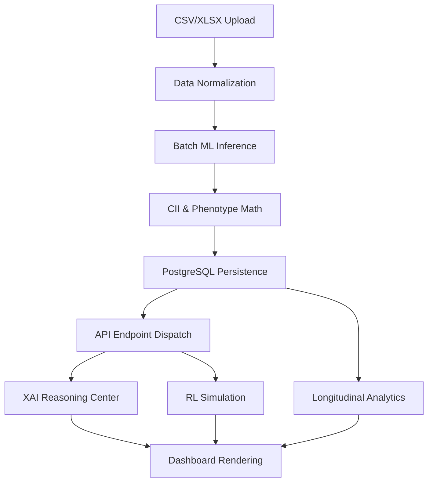

# ChronoHealth AI Platform — Project Workflow & Pipeline

## 1. End-to-End System Workflow

The platform follows a unidirectional data flow for analysis, with bi-directional updates for UI consistency.

### Phase 1: Dataset Ingestion
*   **User Action**: Uploads clinical dataset (CSV, XLSX, or JSON) via `/dashboard/upload`.
*   **Processing**: Backend validates schema and normalizes physiological units (HRV, Light, Cortisol).
*   **Persistence**: Dataset metadata is saved to the `UploadHistory` table.

### Phase 2: Analytics Recomputation
*   **Trigger**: Ingestion completion triggers the `LiveAnalyticsEngine`.
*   **Cleaning**: Existing history for the user is archived to prevent overlaps.
*   **Batch Inference**: The platform runs the entire dataset through the `ClinicalPredictor` in a single vectorized pass.
*   **Indices Generation**: CII, Mood Stability, and Phenotypes are computed for each record.
*   **Persistence**: Final longitudinal records are saved to `PredictionHistory` and `CIIHistory`.

### Phase 3: Intelligence & Reasoning
*   **Explainability**: The `ExplainabilityEngine` computes SHAP values for the most recent record.
*   **RL Simulation**: The `RL_Engine` generates intervention recommendations based on the newly updated state.
*   **Correlations**: The correlation engine performs pairwise Pearson analysis across the entire history.

### Phase 4: Frontend Visualization
*   **Polling**: Dashboard components fetch latest state via `/api/predict` and `/api/cii`.
*   **Rendering**: 
    *   **Stat Cards**: Highlight primary risk tiers.
    *   **Area Charts**: Visualize 7-day biomarker trends.
    *   **Radar Charts**: Show circadian alignment vs. stress resilience.
    *   **Timeline**: Maps the patient journey and intervention triggers.

## 2. Technical Pipeline Summary

## 3. Key Pipeline Nodes
*   **`upload.py`**: Entry point for all external data.
*   **`live_analytics_engine.py`**: The "Brain" that orchestrates data backfilling.
*   **`predictor.py`**: The "Inference Engine" for high-speed predictions.
*   **`api/`**: The "Messenger" layer connecting frontend to intelligence.
